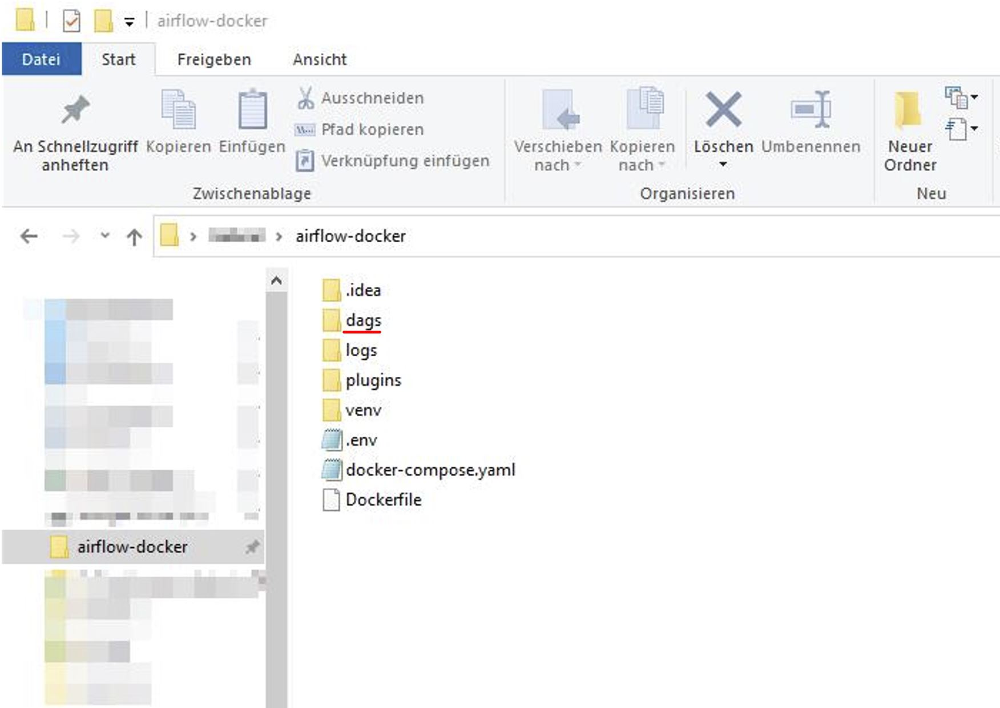

<!-- README.md is generated from README.Rmd. Please edit that file -->

# Moon Radar 

## Overview

Moon Radar measures the popularity of
[altcoins](https://en.wikipedia.org/wiki/Cryptocurrency#Altcoins) on
social media platforms Twitter, Reddit and Google Trends. If it detects
a spike in popularity for a given altcoin, it notifies it’s user by
means of a push notification. The user can then decide to act on this
information by buying or selling shares of the respective
cryptocurrency. Furthermore, Moon Radar retrieves current exchange rates
for altcoins from CoinGecko and reports them alongside the corresponding
popularity index.

## Prerequisites 

Make sure you have the following resources at your disposal.

1.  PostgreSQL Database
2.  Jupyter Notebook
3.  Docker

## Usage 

Start by executing ‘API\_…’ scripts in folder
‘1\_Historical\_data\_to\_RDS’ in a Jupyter Notebook. This will pull
historical data from Google Trend’s, Reddit’s and CoinGecko’s API and
subsequently loads the data obtained into your PostreSQL Data Lake.

  

Next, create a new docker image using the docker-compose.yaml and
Dockerfile within the folder ‘2\_Continuous\_data\_to\_RDS’. Proceed by
adding the ‘API\_to\_RDS.py’ script within the ‘DAG’ folder as a DAG in
your Apache Airflow instance.

   

This procedure will fetch API data at a quarter-hourly rate and uploads
it, supplementing historical data in your PostgreSQL Data Lake with
current, up-to-date, information. That is already it, you established
your own Data Lake which comprises of tweets, posts, queries, etc.
regarding altcoins as well as their currency excange rates!
