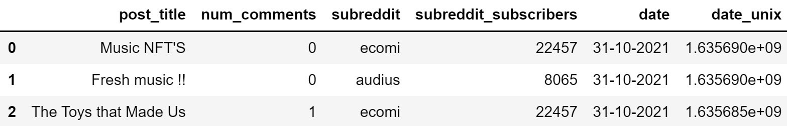
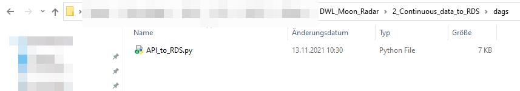

<!-- README.md is generated from README.Rmd. Please edit that file -->

# Moon Radar 

## Overview

Moon Radar measures the popularity of
[altcoins](https://en.wikipedia.org/wiki/Cryptocurrency#Altcoins) on
social media platforms Twitter, Reddit and Google Trends. If it detects
a spike in popularity for a given altcoin, it notifies it’s user by
means of a push notification. The user can then decide to act on this
information by buying or selling shares of the respective
cryptocurrency. Furthermore, Moon Radar retrieves current exchange rates
for altcoins from CoinGecko and reports them alongside the corresponding
popularity index.

## Prerequisites 

Make sure you have the following resources at your disposal.

1.  PostgreSQL Database
2.  Jupyter Notebook
3.  [Apache/Airflow Docker
    Container](https://hub.docker.com/r/apache/airflow)

## Usage 

Start by executing ‘API\_…’ scripts in folder
‘1\_Historical\_data\_to\_RDS’. This will pull historical data from
several social media APIs as well as CoinGecko’s API. Next, run the
remaining script ‘Load\_historical\_data\_into\_datalake’. This will
upload all data obtained into your PostgreSQL database.

  
 

Proceed by adding the file ‘API\_to\_RDS’ from folder
‘2\_Continuous\_data\_to\_RDS’ as a DAG in your docker airflow
container.

   

This procedure will regularly fetch and upload data from the same APIs
as before, supplementing historical data in your PostgreSQL database
with current, up-to-date, information. That is already it, you
established your own datalake which comprises of tweets, posts, queries,
etc. regarding altcoins as well as their currency excange rates!
